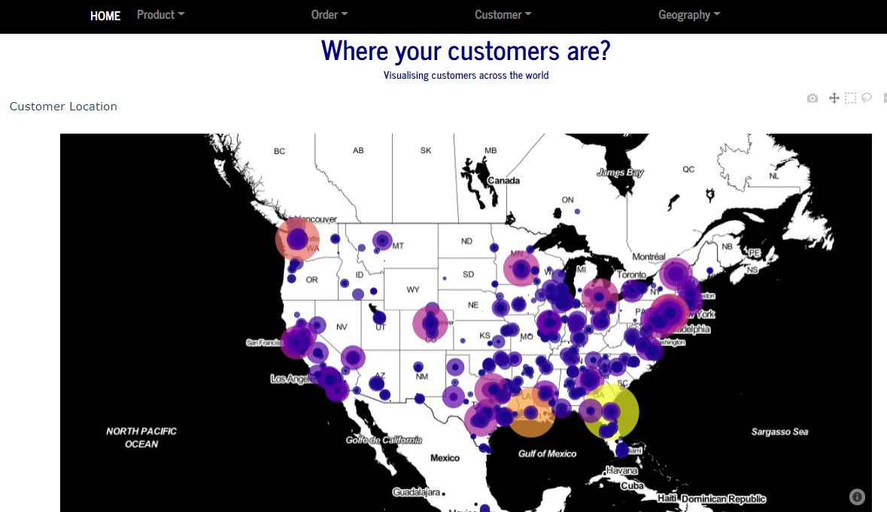
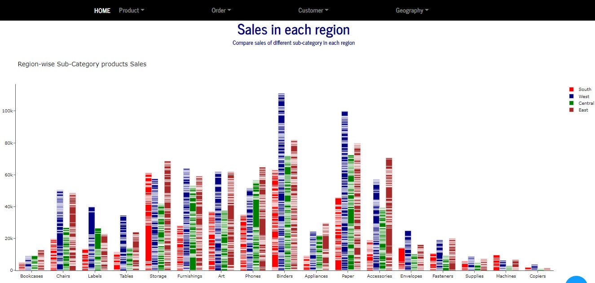
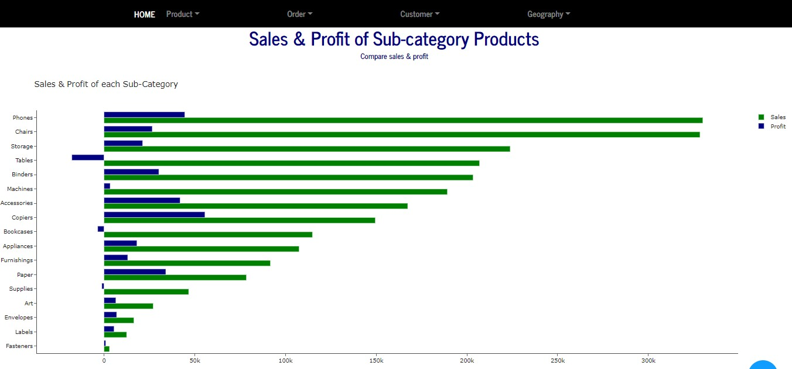
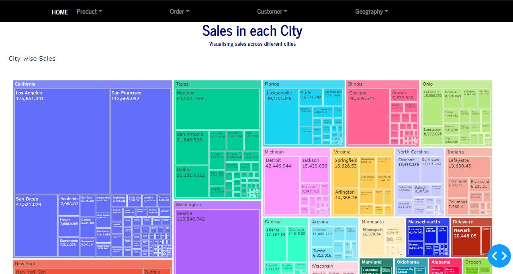

## About Project
This repository contains code for a full-stack web-based Python application.

## How to use it?
Current version of Python( >= 3.9) may not run this application properly due to different versions of dependencies. 
- Install earlier version of [Python(~ 3.6)](https://www.python.org/ftp/python/3.6.8/python-3.6.8-amd64.exe)
- Make a [Virtual Environment](https://gist.github.com/yesdeepakmittal/61494217c8be4a7e61524e27824943bd) and activate it.
- Clone this repository `git clone https://github.com/yesdeepakmittal/Business_Dashboard.git`
- `cd Business_Dashboard`
- `pip install -r requirements.txt`
- run application using `python index.py`
- Check your application in the browser at `http://127.0.0.1:8050/` 

## Overview

## Data Source
[Kaggle](https://www.kaggle.com/juhi1994/superstore)
